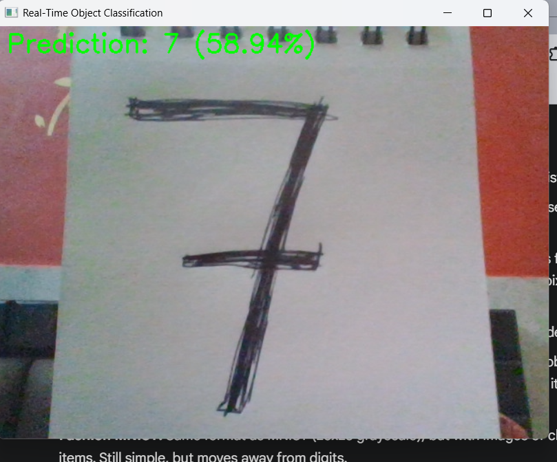

# Real-Time Object Classification using CNN

 A Convolutional Neural Network (CNN) project demonstrating real-time object classification from webcam input, built with TensorFlow/Keras and OpenCV, featuring an optional Streamlit web interface.

## Table of Contents

* [Project Overview](#project-overview)
* [Features](#features)
* [Deliverables](#deliverables)
* [Setup Instructions](#setup-instructions)
* [Usage](#usage)
* [Project Structure](#project-structure)
* [Screenshots of Results](#screenshots-of-results)
* [Contributing](#contributing)
* [License](#license)
* [Contact](#contact)

## Project Overview

This project implements a Convolutional Neural Network (CNN) to perform real-time image classification. Initially trained on the MNIST dataset for digit recognition, the application demonstrates core concepts of deep learning deployment, including model training, real-time inference using webcam input, and an interactive web interface. It serves as a foundational example for developing AI-powered computer vision applications.

## Features

* **CNN Model:** A custom-built CNN architecture using TensorFlow/Keras, specifically designed for image classification tasks.
* **Dataset Handling:** Utilizes the MNIST dataset (handwritten digits) with robust image preprocessing (resizing, normalization). The architecture is adaptable for other small custom datasets.
* **Model Training & Evaluation:** Includes a dedicated script for training the CNN model, saving the trained weights, and visualizing training performance (accuracy and loss curves).
* **Real-Time Inference (Desktop):** Integrates with OpenCV to capture live frames from a webcam, preprocess them, and display real-time classification predictions overlaid on the video feed.
* **Optional Web Interface (Streamlit):** Provides a user-friendly web application for interacting with the model. Users can upload images for classification or use the live webcam feed directly within the browser to see real-time predictions.

## Deliverables

As per the assignment requirements, this repository contains:

* `src/inference.py`: The main script for real-time webcam inference on the desktop.
* `src/app.py`: The Streamlit application for web-based inference.
* `src/train.py`: The script containing the model training code.
* `src/model.py`: Defines the Convolutional Neural Network architecture.
* `src/data_loader.py`: Handles data loading and preprocessing routines.
* `README.md`: This comprehensive project documentation.
* **Screenshots of Results:** Visual evidence of the model's training and inference capabilities, included below.

## Setup Instructions

Follow these steps to set up and run the project locally.

1.  **Clone the Repository:**
    ```bash
    git clone [https://github.com/Ayushman125/realtime_cnn_classifier.git](https://github.com/Ayushman125/realtime_cnn_classifier.git)
    cd realtime_cnn_classifier
    ```

2.  **Create a Virtual Environment (Recommended):**
    ```bash
    python -m venv venv
    ```

3.  **Activate the Virtual Environment:**
    * **On Windows (Command Prompt):**
        ```bash
        venv\Scripts\activate
        ```
    * **On macOS / Linux (Bash/Zsh):**
        ```bash
        source venv/bin/activate
        ```

4.  **Install Dependencies:**
    ```bash
    pip install -r requirements.txt
    ```
    *This will install necessary libraries including `tensorflow`, `opencv-python`, `streamlit`, etc.*

5.  **Configure Git Identity (if you haven't already):**
    Before your first commit, tell Git who you are.
    ```bash
    git config --global user.email "your.email@example.com"
    git config --global user.name "Your Name"
    ```
    (Replace with your actual email and name for commit attribution.)

## Usage

### 1. Train the Model

The model must be trained before it can be used for inference.

```bash
python -m src.train

This script will download the MNIST dataset, train the CNN model, and save the trained weights to models/trained_cnn_model.h5.
A plot showing training and validation accuracy/loss will be displayed and saved as results/training_history.png.
2. Run Real-Time Webcam Inference (Desktop Application)
Ensure your webcam is connected and accessible.

Bash

python -m src.inference
A new window will open displaying your webcam feed with real-time predictions overlaid.
Press q to quit the webcam feed.
3. (Optional) Run the Web Interface (Streamlit)
This launches a local web server for browser-based interaction.

Bash

streamlit run src/app.py
Your default web browser will open, usually navigating to http://localhost:8501.
You can then upload an image or activate the webcam feed directly within the browser for live predictions.
To stop: Close the browser tab or press Ctrl+C in the terminal where Streamlit is running.
Project Structure
realtime_cnn_classifier/
├── models/
│   └── trained_cnn_model.h5  # Trained model file (generated after training)
├── results/
│   └── training_history.png  # Plot of training metrics (generated after training)
├── src/
│   ├── __init__.py           # Makes 'src' a Python package
│   ├── data_loader.py        # Data preprocessing and loading
│   ├── model.py              # CNN model definition
│   ├── train.py              # Model training script
│   ├── inference.py          # Real-time webcam inference (desktop)
│   └── app.py                # Streamlit web application
├── utils/
│   └── plots.py              # Utility for plotting training history
├── images/                   # Directory to store screenshots for README.md
│   ├── training_accuracy_graph.png  # Screenshot of accuracy graph
│   ├── desktop_inference_1.png      # Screenshot of first webcam output
│   ├── desktop_inference_2.png      # Screenshot of second webcam output
│   └── desktop_inference_3.png      # Screenshot of third webcam output
├── README.md
├── requirements.txt
└── venv/                     # Python virtual environment (ignored by Git)
Screenshots of Results
Here are visual demonstrations of the project's output:

Model Training Accuracy Graph
Description: This graph shows the model's performance during training, illustrating the convergence of both training and validation accuracy/loss over epochs.

Desktop Real-Time Inference Examples
These screenshots showcase various predictions from the real-time desktop webcam application.

Webcam Output 1
Description: A live frame from the desktop application, displaying a digit prediction (e.g., when a handwritten digit is shown or a random pattern is identified).

Webcam Output 2
Description: Another example of the real-time classification, showing a different prediction or scenario from the webcam feed.

Webcam Output 3
Description: A third illustration of the model's output on live webcam data, further demonstrating its real-time capabilities.

Contributing
Contributions are welcome! If you find any bugs or have suggestions for improvements, please open an issue or submit a pull request.

License
This project is licensed under the MIT License - see the LICENSE file for details (You might need to create a https://www.google.com/search?q=LICENSE file).

## Contact

Ayushman Saini - Your GitHub Profile (e.g., https://github.com/Ayushman125)
[Your LinkedIn Profile (Optional)]
[Your Email (Optional)]